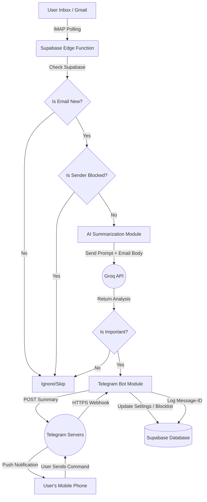

# Email Summary to Telegram Notification System

## 1. Project Overview
This project is an open-source, single-user automation tool designed to monitor incoming emails, summarize them using a free AI model, and instantly send the summary to the user's phone via Telegram. The goal is to provide a zero-cost, highly private solution to manage email overload without relying on expensive SaaS subscriptions or paid APIs.

---

## 2. Technology Stack
Since the core requirement is **zero cost** and **single-user deployment**, the stack relies strictly on free tiers and serverless execution:
- **Backend / Execution:** TypeScript (Deno) deployed as a **Supabase Edge Function**. This means zero servers to run locally.
- **Email Integration:** Standard IMAP libraries compatible with Deno/Node.js.
- **AI / LLM:** Groq API (Free Tier) for ultra-fast, free text summarization (e.g., using Llama 3).
- **Notification System:** Telegram Bot API (100% Free).
- **Database:** Supabase (or Firebase) for cloud-based state management (tracking processed emails and blocklists). Supabase offers a generous free tier for PostgreSQL.
- **Environment Management:** `python-dotenv` for managing sensitive credentials securely.

---

## 3. System Architecture & Flow

The system is fully serverless. A Supabase Edge Function is triggered on a Cron schedule (e.g., every 5 minutes) to poll the email server, process new data, and push alerts.



---

## 4. Detailed Component Documentation

### A. How the User Connects Their Email (The Input)
**Concept:** The system uses IMAP (Internet Message Access Protocol) to securely read emails directly from the server.
**Process:**
1. **App Passwords:** The user does not use their primary email password. Instead, if using Gmail, they go to Google Account Security and generate an "App Password" (a 16-character code).
2. **Configuration:** The user puts their Email Address and App Password into a `.env` file on their computer.
3. **Execution:** The Supabase Edge Function runs automatically on a cloud cron schedule and connects to `imap.gmail.com` on Port `993` (SSL).
4. **Data Extraction & Filtering:** The script searches for `UNSEEN` (unread) emails (limited to a max batch of 5 to prevent overload). To respect the strict 50MB memory limit of Edge Functions, it *only* fetches the text body (`BODY.PEEK[TEXT]`) and completely ignores attachments.
5. **Blocklist Check:** Before sending to AI, the system queries the Supabase database. If the `Sender` is on the user's blocklist, the email is immediately skipped.
**Input Data:** Text-only email content (attachments strictly ignored).

### B. How the AI Analyzes the Email (The Processing)
**Concept:** Large emails need to be condensed into short, actionable bullet points.
**Process:**
1. **Prompt Engineering:** The script wraps the extracted email body in a strict prompt. 
   *Example Prompt: "Analyze this email. First, classify it as 'IMPORTANT' or 'ROUTINE'. Only if it is 'IMPORTANT', provide a 3-bullet-point summary under 500 characters."*
2. **API Call & Decision:** The script sends this prompt to the Groq API (using a fast model like Llama 3). If the AI replies that the email is 'ROUTINE' (e.g., a newsletter or spam), the script ignores it and stops processing.
3. **Data Privacy:** Because this is an open-source tool isolated within your own personal Supabase project, only the specific unread email text is sent to the AI; no entire inbox data is shared.
**Output Data:** A concise summary (if important) or an empty skip signal (if routine).

### C. How the Telegram Bot Sends the Notification (The Output)
**Concept:** Telegram provides a free API to send messages directly to your phone via a Bot.
**Process:**
1. **Bot Creation:** The user opens Telegram, searches for `@BotFather`, and types `/newbot`. BotFather provides a `BOT_TOKEN`.
2. **Getting Chat ID:** The user sends a message to their new bot, and uses a simple script to get their unique `CHAT_ID`.
3. **Configuration:** The `BOT_TOKEN` and `CHAT_ID` are saved in the local `.env` file.
4. **Delivery:** When the AI finishes summarizing, the Edge Function makes a standard HTTP POST request to:
   `https://api.telegram.org/bot<BOT_TOKEN>/sendMessage` 
   passing the `CHAT_ID` and the AI-generated summary as the text.
5. The user's phone vibrates instantly with the summary.

### D. State Management (Preventing Duplicates)
To ensure the user doesn't get pinged about the same email twice:
1. Every email has a unique `Message-ID` in its header.
2. Once the Telegram message is successfully sent, the script saves that `Message-ID` into the cloud database (Supabase or Firebase).
3. On the next run, the script checks the cloud database. If the `Message-ID` is already there, it skips the email entirely.

### E. Telegram Bot Interactions (Blocklist & Preferences)
**Concept:** The user should have control over who they receive summaries from directly within Telegram.
**Process:**
1. **Interactive Commands (Webhooks):** Instead of continuous polling, Telegram is configured with a Webhook. Whenever the user taps a button or sends a command, Telegram sends an instant HTTPS POST request directly to the Supabase Edge Function URL.
2. **Blocking Senders:** If the user receives a summary from an annoying sender, they can reply to the bot with: `/block sender@example.com`
3. **Database Update:** The webhook wakes up the Edge Function, which parses the command and inserts the email address into a `blocked_contacts` table in Supabase.
4. **Future Emails:** The next time an email arrives from `sender@example.com`, Step 4.A intercepts it and deletes/ignores it before it even reaches the AI, saving API calls and keeping the user's phone quiet.

## 5. Advanced Features & Telegram Bot UI

Because the system relies on Telegram for its entire UI/UX, we do not need a web dashboard. All interactions are handled natively via chat commands and inline buttons.

### A. Telegram-Only Onboarding & Multi-Email
The user can connect multiple email accounts entirely through chat:
1. User sends `/add_email` to the bot.
2. Bot requests the Email Address and App Password.
3. Supabase securely stores this mapping (1 Telegram User -> N Email Accounts).
4. The backend cron job iterates through all connected inboxes.

### B. Actionable Inline Buttons
Every summary sent to the user will include interactive inline buttons at the bottom:
- 🕒 **[Remind me in 1 Hour] / 📅 [Remind me Tomorrow]**: Supabase queues the summary to be resent at a later time.
- 🌐 **[Translate to X]**: Instantly triggers Groq to translate the summary into another language.
- 🔕 **[Block Sender]**: One-click addition to the blocklist.
- ✅ **[Mark as Read] / 🗑️ [Archive]**: The Edge Function connects back via IMAP to mark the original email as read or move it, saving the user from opening their email app.

### C. Dashboard & Digest Commands
Users can manage their experience using text commands:
- `/digest` - Generates a quick summary of all emails missed in the last 24 hours.
- `/snooze 8h` - Pauses all notifications (Quiet Hours). Summaries are queued in Supabase and delivered as a batch when the snooze ends.
- `/vip boss@company.com` - Adds an email to a whitelist, guaranteeing it bypasses AI importance filters and alerts the user instantly.

## 6. Security & Database Schema

### A. Credential Security (Supabase Vault)
Storing email App Passwords in plain text is a critical security risk. The system uses **Supabase Vault** (pg_crypto) to encrypt the user's App Passwords natively within PostgreSQL. The Edge Function only decrypts them in memory during execution.

### B. Core Database Schema (PostgreSQL)
The Supabase database is designed to support the 1-to-Many Telegram-to-Email relationship and manage queues natively.

```sql
-- Users (Telegram Identity)
CREATE TABLE users (
    telegram_id BIGINT PRIMARY KEY,
    username TEXT,
    created_at TIMESTAMP DEFAULT NOW()
);

-- Email Accounts (1:N relationship with Users)
CREATE TABLE email_accounts (
    id UUID PRIMARY KEY DEFAULT gen_random_uuid(),
    user_telegram_id BIGINT REFERENCES users(telegram_id),
    email_address TEXT NOT NULL,
    app_password TEXT NOT NULL, -- Stored securely via Supabase Vault
    is_active BOOLEAN DEFAULT true
);

-- Tracking to prevent duplicate alerts
CREATE TABLE processed_emails (
    message_id TEXT PRIMARY KEY,
    email_account_id UUID REFERENCES email_accounts(id)
);

-- Preferences (Blocklist & VIP)
CREATE TABLE blocklist (
    user_telegram_id BIGINT REFERENCES users(telegram_id),
    sender_email TEXT,
    PRIMARY KEY (user_telegram_id, sender_email)
);

CREATE TABLE vip_list (
    user_telegram_id BIGINT REFERENCES users(telegram_id),
    sender_email TEXT,
    PRIMARY KEY (user_telegram_id, sender_email)
);
```
